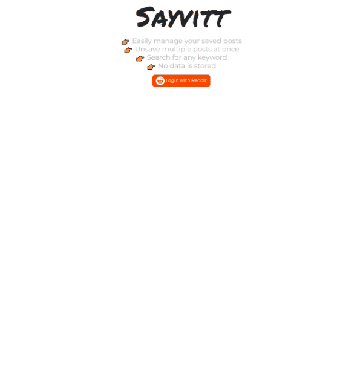

<h1 align="center">🧡 
  Sayvitt
</h1>
<h3 align="center">The Reddit Saved Posts Manager</h3>

 

<h3 align="center"><a href="https://sayvitt.herokuapp.com" target="_blank">Live preview </a></h3>

## 💬 Overview

A better way to manage you saved posts on Reddit. Just log in using your account and start organizing!

## 🆕 New

Added a feature to export all your saved items as JSON or import a JSON file to save multiple items.

## 🏆 Features

- Easily manage your saved posts

- Unsave multiple posts at once

- Search for any keyword

- Filter by subreddit

- No data is stored

## 🚀 Quick start

To run locally you can just do `npm run dev`, but make sure to provide the API keys in a `.env` file before starting.
